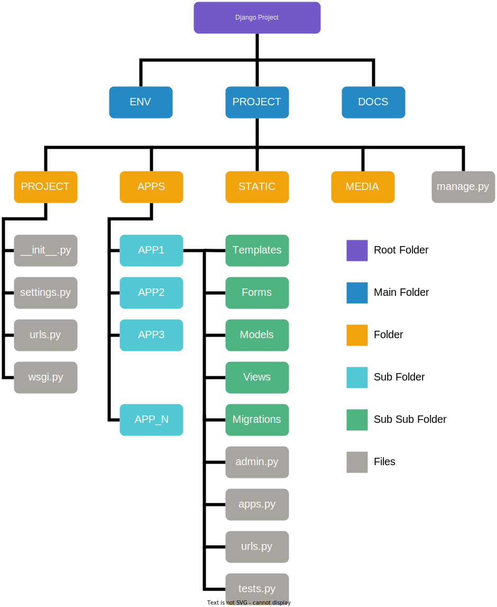

<div align="center">
  <h1 align="center">
    <br>
    <a href="https://gitlab.ums.ac.id/rr867/project-base">
      
    </a>
    <br>
      
      Project Base
      
    <br>
  </h1>
</div>


<div align="center">
  <h4 align="center">
    
    "Designed to start a new project"
    
  </h4>
</div>


<div align="center">
  <p align="center">
    <a href="https://forthebadge.com">
      
    </a>
    <a href="https://forthebadge.com">
      
    </a>
  </p>
</div>


<div align="center">
  <p align="center">
    <a href="https://pypi.org/project/Django/5.2.5/" title="Django">
      
    </a>
    <a href="https://pypi.org/project/gunicorn/23.0.0/" title="Gunicorn">
      
    </a>
    <a href="https://pypi.org/project/whitenoise/6.9.0/" title="Whitenoise">
      
    </a>
    <a href="https://pypi.org/project/pillow/11.3.0/" title="Pillow">
      
    </a>
    <a href="https://pypi.org/project/django-hijack/3.7.4/" title="Django Hijack">
      
    </a>
    <a href="https://pypi.org/project/django-cas-ng/5.0.1/" title="Django CAS">
      
    </a>
    <a href="https://pypi.org/project/PyJWT/2.10.1/" title="PyJWT">
      
    </a>
    <a href="https://pypi.org/project/python-decouple/3.8/" title="Python Decouple">
      
    </a>
    <a href="https://pypi.org/project/psycopg2/3.2.9/" title="Psycopg2">
      
    </a>
    <a href="https://pypi.org/project/mysqlclient/2.2.7/" title="Mysqlclient">
      
    </a>
    <a href="https://pypi.org/project/django-private-storage/3.1.1/" title="Private Storage">
      
    </a>
  </p>
</div>


<div align="center">
  <p align="center">
    <a href="#getting-started">View Demo</a> •
    <a href="#contributors-✨">Report Bug</a> •
    <a href="#features">Request Feature</a> •
    <a href="#license">License</a>
  </p>
</div>


<br><br><br>


## Client

| Name | Description |
| --- | --- |
| Request from | Biro Teknologi Informasi |
| Person in charge | Alfani Muslich Nugroho |
| Contact | 1235 |


<br><br><br>


## Stack

| Name | Description |
| --- | --- |
| Language | Python v3.10+ |
| Framework | Django v5.2.5 |
| Template | Ace Admin v4.0.0 |
| Database | Postgresql v12+ / Mysql v8.0+ |


<br><br><br>


## Development Environment

| Name | Description |
| --- | --- |
| Cluster | Development |
| IP & Port | 127.0.0.1:8000 |
| Domain | dev.ums.ac.id |
| DB Host | 127.0.0.1 |
| DB Port | 5432 |
| DB Name | projectbase |


<br><br><br>


## Notes
Before using this project please read the following documentation and references:

<ol>
  <li>Documentation
    <ul>
      <li><a href='https://docs.djangoproject.com/en/5.1/'>Django</a></li>
      <li><a href='https://python-textbok.readthedocs.io/en/1.0/'>Object Oriented Programming</a></li>
    </ul>
  </li>

  <li>Reference
    <ul>
      <li><a href='https://testdriven.io/blog/clean-code-python/'>Clean Code in Python</a></li>
      <li><a href='https://github.com/HackSoftware/Django-Styleguide'>Django Styleguide</a></li>
    </ul>
  </li>
</ol> 


<br><br><br>


## Getting Started With Zero Configuration
**1. Install [Docker](https://www.docker.com/)**

**2. Clone the project repository and enter it in the project directory**

```bash
$ git clone https://gitlab.ums.ac.id/rr867/project-base.git

$ cd project-base
```

**3. Run the application using Docker Compose**
```
$ docker compose up -d --build
```

**4. Access the application in the browser**
```
Open: http://localhost:8000
```

**5. Login to the application**
```
Username: root
Password: root
```


<br><br><br>


## Getting Started
### Install Requirements
1. Install python 3.10 for this project
2. Install pylaucher if you are using multiple versions of python (optional)
3. Install postgresql database for production
4. Install mysql database for development (optional)


### How to Install Project
To clone and run this application, you'll need [Git](https://git-scm.com) and [Python](https://www.python.org/downloads/) (which comes with [pylauncher](https://pypi.org/project/pylauncher/)) installed on your computer. From your command line:

```bash
$ git clone https://gitlab.ums.ac.id/rr867/project-base.git

$ cd project-base

$ py -3.10 -m venv env (With PyLaucher)

$ python -m venv env (Basic)

$ env/scripts/activate

$ python -m pip install -r requirements.txt


```


### Create Database & File .env
- Create a database in your locale, you can use mysql or postgresql
- Create .env file in the root folder:
  - Copy file .env_dev
  - rename the .env_dev (copy) file to .env
  - then customize the contents


### Create File Migration & Migrate to database
```bash
$ cd project

$ python manage.py makemigrations

$ python manage.py makemigrations authentication

$ python manage.py makemigrations main

$ python manage.py migrate
```


### Load Primary Data in Fixtures Folder (Inside App Services)
```bash
$ python manage.py loaddata group
$ python manage.py loaddata groupdetails
```


### How to Run Project
- If you are running from docker locally and using a local db, change DB_HOST in the env file to -> host.docker.internal
- it will connect with your docker container to local database
```bash
$ python manage.py collectstatic (if DEBUG = False)

# Run the app
$ python manage.py runserver
```


<br><br><br>


## Using Deployment Jenkins
If you want to use **CI/CD** integration with **Jenkins**, you can use **Jenkinsfile** that provided in this repository.
this **Jenkinsfile** has capable to make advance configuration, some of that is:
* **Limit amount of builded Image**
* **Create Versioning**

And in the future this **Jenkinsfile** will have an additional capabilities:

* **Auto Deployment**
* **Security Checking**
* and soon

<br>

### Jenkinsfile Usage
You can use this Jenkinsfile in your project, with some rules:

**In Project**

1. project is shared/inherit with groups: [**UMS**](https://gitlab.ums.ac.id/ums) or [**Project Base Inheritance**](https://gitlab.ums.ac.id/project-base-inheritance)
2. Make sure user [aam778@ums.ac.id](https://gitlab.ums.ac.id/aam778) as **maintener** at the project
3. Put **Jenkinsfile** in the root project
4. Make sure Webhook is setup, you can check it in: Settings -> Webhooks
    * If webhook is not available, please contact [aam778@ums.ac.id](https://gitlab.ums.ac.id/aam778)


**Git Push/Merge**
You can specify versioning with 3 stages:

| Stage | Level | Level Description |
|---|---|---|
| Stage 1 | Major Changes | for changes that affect on full/most of the projects structure (e.g architectural changes, language changes, etc) |
| Stage 2 | Featured Changes | for changes that affect on part of the projects structure (e.g add more feature, etc) |
| Stage 3 | Minor Changes | for changes that does`nt affect on structure projects (e.g bug fixes, etc) |

The default stage is **3**, if you want to change stage of **versioning**, using this in **commit message**:

```bash
  # for Major Changes
  --mc, # example git commit -m "update --mc"
  # for Featured Changes
  --fc, # example git commit -m "update --fc"
``` 


<br><br><br>


## Tips

### Create Secret Key
- After downloading this project, you have to replace SECRET_KEY with the following command. Copy the result and replace SECRET_KEY
```bash
$ python -c 'from django.core.management.utils import get_random_secret_key; print(get_random_secret_key())'
```


### How to Add New Apps
- Go to the apps folder on the terminal
- Type the following command : django-admin startapp appsname
- Open apps.py file and change the value of the name variable. Add "apps." in front of.
- Example : name = 'newapps' change to -> name = 'apps.newapps'


### How to Create Fixtures File
- Type the following command :
```bash
$ python manage.py dumpdata appName.modelName --indent 2 > apps/services/fixtures/modelName.json
```
- Make sure the file encoding type is UTF-8


<br><br><br>


## Project Architecture
Best practice for the Django project architecture

<details>
<summary>Desain Architecture (Click Me)</summary>

</details>


<br>


<details>
<summary>Details Architecture (Click Me)</summary>

```
.
├── 📦docs
├── 📦env
└── 📦project/
    ├── 📂apps/
    │   ├── 📂services/
    │   │   ├── 📂fixtures/
    │   │   │   └── 📜group.json
    │   │   ├── 📜apps.py
    │   │   ├── 📜apigateway.py
    │   │   └── 📜utils.py
    │   ├── 📂authentication/
    │   ├── 📂landingpage/
    │   └── 📂main/
    │       ├── 📂forms/
    │       ├── 📂migrations/
    │       ├── 📂models/
    │       ├── 📂templates/
    │       │   └── 📂main/
    │       │       ├── 📂account/
    │       │       │   ├── 📜add.html
    │       │       │   ├── 📜edit.html
    │       │       │   └── 📜table.html
    │       │       ├── 📂category/
    │       │       │   ├── 📜add.html
    │       │       │   ├── 📜edit.html
    │       │       │   └── 📜table.html
    │       │       ├── 📂layout/
    │       │       │   ├── 📜base.html
    │       │       │   ├── 📜footer.html
    │       │       │   ├── 📜head.html
    │       │       │   ├── 📜javascript.html
    │       │       │   ├── 📜navbar.html
    │       │       │   └── 📜sidebar.html
    │       │       └── 📜index.html
    │       ├── 📂templatetags/
    │       ├── 📂views/
    │       │   ├── 📜account.py
    │       │   ├── 📜category.py
    │       │   └── 📜dashboard.py
    │       ├── 📜admin.py
    │       ├── 📜apps.py
    │       └── 📜urls.py
    ├── 📂media/
    │   └── 📂images/
    │   └── 📂files/
    ├── 📂project/
    │   ├── 📜asgi.py
    │   ├── 📜settings.py
    │   ├── 📜urls.py
    │   └── 📜wsgi.py
    ├── 📂static/
    │   ├── 📂admin
    │   ├── 📂hijack
    │   ├── 📂images/
    │   │   ├── 📂background
    │   │   ├── 📂email
    │   │   ├── 📂error
    │   │   ├── 📂logo
    │   │   └── 📂profile
    │   └── 📂template
    ├── 📜manage.py
    └── 📜token.json
```
</details>


<br><br><br>


## Features

<ol>
  <li>Landing Page
    <ul>
      <li>Home Page</li>
    </ul>
  </li>
  <li>Authentication Page
    <ul>
      <li>Login Page</li>
      <li>Register Page</li>
      <li>Forgot Page</li>
      <li>Verified Page</li>
      <li>Login SSO (UMS CAS)</li>
    </ul>
  </li>
  <li>Admin Page
    <ul>
      <li>Dashboard Page</li>
      <li>Profile Page</li>
      <li>Sync Profile</li>
      <li>Hijack Feature</li>
      <li>Account Management</li>
      <li>Role Management</li>
      <li>Default CRUD</li>
      <li>Setting Page</li>
      <li>Import User From SIHRD</li>
    </ul>
  </li>
  <li>Other
    <ul>
      <li>API Gateway Helper</li>
      <li>Custom Context Processors</li>
      <li>Authorization Decorator</li>
      <li>Custom Django CAS (Sync With SiHRD)</li>
      <li>Complete Hijack With Session</li>
      <li>Export Data to Excel/PDF</li>
      <li>Multiple Select Data</li>
      <li>Group Details (Table)</li>
      <li>Profile Details (Table)</li>
      <li>Dockerfile & Docker Compose</li>
      <li>Change Debug to False Without Error</li>
      <li>Email Verification</li>
      <li>Private Storage</li>
      <li>...</li>
    </ul>
  </li>
</ol> 


<br><br><br>


## Tips and Suggestions

Berikut adalah beberapa tips yang dapat memudahkan kamu dalam pengembangan proyek Django dan menjaga kualitas kode yang lebih baik:

<ol>
  <li>
  Gunakan Virtual Environments<br>
  Selalu gunakan virtual environment untuk setiap proyek. Ini akan memisahkan dependensi proyek kamu dari sistem Python global dan menghindari konflik versi library antara proyek yang berbeda.
  </li>

  <li>
  Gunakan Library Secukupnya<br>
  Hindari menambah terlalu banyak library. Gunakan hanya library yang benar-benar diperlukan agar tidak membebani pengembangan dan memudahkan pemeliharaan di masa depan.
  </li>

  <li>
  Pahami Penggunaan Queryset dengan Bijak<br>
  Menggunakan Django ORM secara efisien adalah kunci performa yang baik. Pastikan untuk:
    Menghindari query berlebihan atau penggunaan filter yang tidak efisien.
    Gunakan select_related() atau prefetch_related() saat mengambil data yang berhubungan, untuk menghindari masalah N+1 query.
  </li>

  <li>
  Manajemen Migrasi dengan Hati-Hati<br>
  Sebaiknya, jangan hanya mengandalkan makemigrations dan migrate tanpa hati-hati. Dalam proyek besar, pengelolaan migrasi yang buruk dapat menyebabkan kesalahan saat melakukan deploy atau ketika banyak perubahan struktur database.
  Saran: Selalu lakukan migrasi di environment yang terisolasi terlebih dahulu (misalnya, di server staging). Hindari mengedit file migrasi manual jika tidak perlu.
  </li>
  
  <li>
  Pilih Library yang Berkelanjutan<br>
  Pilihlah library yang aktif diperbarui dan didukung jangka panjang. Menggunakan library yang jarang diperbarui bisa menyebabkan masalah di masa depan.
  </li>
  
  <li>
  Tulis requirements.txt secara Manual<br>
  Jangan menggunakan pip freeze untuk menghasilkan file requirements.txt. Menggunakan pip freeze bisa menyebabkan masalah kompatibilitas antar library dan potensi tabrakan versi. Sebaiknya tulis dependensi secara manual untuk memastikan versi yang stabil.
  </li>

  <li>
  Hindari Penggunaan import menggunakan asterisk (*)<br>
  Jangan menggunakan import * terlalu sering. Ini dapat menyulitkan proses debugging karena sulit untuk mengetahui dari mana fungsi atau kelas berasal.
  </li>

  <li>
  Gunakan Nama Variabel yang Deskriptif<br>
  Hindari penggunaan nama variabel yang terlalu singkat, seperti satu huruf saja. Gunakan nama yang menggambarkan isi variabel dengan jelas untuk mempermudah debugging.
  </li>

  <li>
  Pahami Konsep Scope<br>
  Pastikan fungsi dan kelas yang kamu buat berada dalam file yang tepat. Jangan membuat fungsi yang terlalu umum di dalam file yang khusus. Ini membantu menjaga kode tetap modular dan mudah dikembangkan.
  </li>

  <li>
  Tambahkan Method __str__ pada Kelas<br>
  Setiap kelas yang kamu buat sebaiknya memiliki method __str__ untuk memudahkan debugging. Dengan cara ini, kamu bisa mencetak instance dan melihat data yang ada di dalamnya.
  </li>

  <li>
  Berikan Komentar yang Jelas<br>
  Jika kamu merasa kode akan sulit dipahami oleh orang lain (atau kamu sendiri), jangan malas untuk menambahkan komentar atau dokumentasi. Komentar akan membantu saat melakukan debugging, terutama untuk error logika.
  </li>

  <li>
  Gunakan Pola Nama yang Konsisten<br>
  Gunakan pola penamaan yang konsisten untuk variabel, fungsi, dan kelas agar memudahkan pencarian dan penggantian menggunakan fitur pencarian. Contoh: gunakan set untuk mengubah data dan get untuk mengambil data.
  </li>

  <li>
  Pisahkan Backend dan Frontend<br>
  Pisahkan logika bisnis (backend) dan tampilan (frontend). Jangan campurkan CSS dalam forms.py. Gunakan forms.py hanya untuk validasi dan pembuatan form, sedangkan CSS sebaiknya dikelola dalam file HTML atau file CSS terpisah.
  </li>

  <li>
  Gunakan Template Tags untuk Manipulasi Data Saja<br>
  Jangan gunakan template tags untuk mengambil data langsung dari database atau API. Pisahkan logika bisnis dan tampilan agar lebih mudah dalam debugging.
  </li>

  <li>
  Gunakan Fixtures untuk Data Awal<br>
  Jika ada data yang harus dimiliki saat pertama kali aplikasi diinstal, gunakan fitur fixtures pada Django. Simpan data dalam file .json dan simpan dalam folder fixtures. Sehingga pada saat sistem pertama kali diinstall data yang wajib ada pada database dapat di muat menggunakan perintah python manage.py loaddata namafile.json
  </li>

  <li>
  Urutkan Kode dengan Logis<br>
  Urutkan kode program dengan baik. Jangan buat variabel yang berisi query database tetapi hanya digunakan setelah berada dalam kondisi (if else) terpenuhi. Ini akan menghemat memori dan mempermudah debugging.
  </li>

  <li>
  Pisahkan Kode dengan Spasi/Enter<br>
  Gunakan baris kosong untuk memisahkan bagian-bagian kode yang memiliki fungsi atau algoritma yang berbeda. Ini akan membuat kode lebih mudah dibaca dan dipahami.
  </li>

  <li>
  Hapus dan Buat Ulang Migrations Sebelum Ke Production<br>
  Setelah tahap development selesai dan sebelum masuk ke production, hapus folder migrations dan buat ulang menggunakan (python manage.py makemigrations). Pastikan file migrations terbaru di-push ke repository dan jangan masukkan folder migrations ke .gitignore.
  </li>

  <li>
  Gunakan Environment Variables untuk Konfigurasi Sensitif<br>
  Sebaiknya hindari menulis pengaturan sensitif seperti kunci API, kredensial database, atau rahasia lainnya langsung di file pengaturan Django. Sebagai gantinya, gunakan environment variables yang bisa dibaca oleh aplikasi pada saat runtime.
  Saran: Gunakan library python-decouple atau python-dotenv untuk memudahkan pengelolaan dan pembacaan environment variables.
  </li>

  <li>
  Gunakan Reusable Modules dan Functions<br>
  Buat kode yang dapat digunakan kembali untuk menghindari duplikasi dan meningkatkan modularitas. Misalnya, buat utility functions, helper functions, atau services yang dapat digunakan di berbagai tempat.
  Saran : Pisahkan kode yang bersifat umum dalam utils.py atau folder khusus yang mudah diimpor ke aplikasi lain.
  </li>
</ol>


<br><br><br>


## Credits

This software uses the following open source packages:

- [Django==5.2.5](https://pypi.org/project/Django/5.2.5/)
- [gunicorn==23.0.0](https://pypi.org/project/gunicorn/23.0.0/)
- [whitenoise==6.9.0](https://pypi.org/project/whitenoise/6.9.0/)
- [Pillow==11.3.0](https://pypi.org/project/pillow/11.3.0/)
- [django-hijack==3.7.4](https://pypi.org/project/django-hijack/3.7.4/)
- [django-cas-ng==5.0.1](https://pypi.org/project/django-cas-ng/5.0.1/)
- [PyJWT==2.10.1](https://pypi.org/project/PyJWT/2.10.1/)
- [python-decouple==3.8](https://pypi.org/project/python-decouple/3.8/)
- [psycopg2==3.2.9](https://pypi.org/project/psycopg2/3.2.9/)
- [mysqlclient==2.2.7](https://pypi.org/project/mysqlclient/2.2.7/)
- [django-private-storage==3.1.1](https://pypi.org/project/django-private-storage/3.1.1/)


<br><br><br>


## License

[](/license.txt)


<br><br><br>


## Contributors ✨

Thanks goes to these wonderful people :
<!-- ================================================================== -->
<!--                    ALL-CONTRIBUTORS-LIST:START                     -->
<!--                DO NOT REMOVE or MODIFY THIS SECTION                -->
<!-- ================================================================== -->

<table>
  <tr>
    <td align="center">
      <a href="https://gitlab.ums.ac.id/rr867">
        
        <br />
        <sub>
          <b>Ridwan Renaldi, S.Kom.</b>
        </sub>
      </a>
      <br />
      <a href="" title="Answering Questions">💬</a> 
      <a href="" title="Code">💻</a> 
      <a href="" title="Design">🎨</a> 
      <a href="" title="Documentation">📖</a> 
    </td>
    <td align="center">
      <a href="https://gitlab.ums.ac.id/mhi595">
        
        <br />
        <sub>
          <b>Muhammad Hammam Islami , S.Kom.</b>
        </sub>
      </a>
      <br />
      <a href="" title="Code">💻</a>
    </td>
    <td align="center">
      <a href="https://gitlab.ums.ac.id/aam778">
        
        <br />
        <sub>
          <b>Arrijal Amar Ma`ruf, S.Kom.</b>
        </sub>
      </a>
      <br />
      <a href="" title="Code">💻</a>
    </td>
  </tr>
</table>